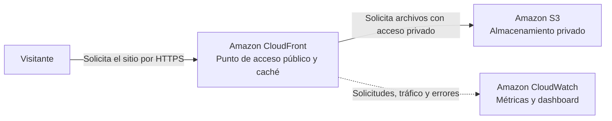
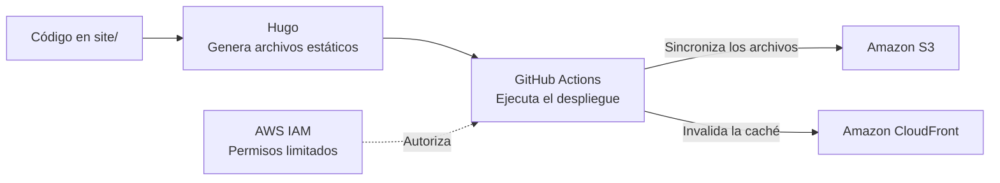

# DevOps en la Nube con AWS y GitHub Actions

Taller práctico para publicar un sitio personal creado con Hugo en un bucket
privado de Amazon S3, servirlo con CloudFront y desplegar cambios desde GitHub
Actions.

## Arquitectura en AWS



- **S3** conserva los archivos del sitio sin exponerlos directamente a Internet.
- **CloudFront** proporciona HTTPS, controla el acceso a S3 y mantiene archivos
  en caché para entregarlos más rápido.
- **CloudWatch** permite observar el tráfico y los errores de CloudFront.

## Requisitos

- Una cuenta de AWS con acceso a CloudShell y permisos para crear los recursos.
- Una cuenta de GitHub.
- Terraform instalado en CloudShell. Lo instalaremos durante el taller.

`mise` no es un requisito. Si ya lo utilizas, puedes ejecutar `mise install`
para instalar las versiones de Terraform y Hugo fijadas en `mise.toml`.

## Instala Terraform en AWS CloudShell

Abre AWS CloudShell y ejecuta:

```sh
sudo yum install -y yum-utils
sudo yum-config-manager \
  --add-repo https://rpm.releases.hashicorp.com/AmazonLinux/hashicorp.repo
sudo yum install -y terraform

terraform version
```

CloudShell utiliza Amazon Linux 2023 y permite instalar paquetes con `sudo`.
Si el entorno se reinicia, es posible que debas repetir la instalación.

## 1. Crea tu repositorio

En GitHub, selecciona **Use this template** y crea una copia en tu cuenta.
Después, abre AWS CloudShell y clona tu repositorio:

```sh
git clone https://github.com/<tu-usuario>/DevOps-en-la-Nube-con-AWS-y-GitHub-Actions.git
cd DevOps-en-la-Nube-con-AWS-y-GitHub-Actions
```

## 2. Provisiona la infraestructura

```sh
cd ~/DevOps-en-la-Nube-con-AWS-y-GitHub-Actions/infrastructure
cp terraform.tfvars.example terraform.tfvars
nano terraform.tfvars
```

Reemplaza el usuario de ejemplo por tu usuario de GitHub en minúsculas:

```hcl
aws_region      = "us-east-1"
github_username = "tu-usuario"
```

En `nano`, guarda con `Ctrl+O`, confirma con `Enter` y sal con `Ctrl+X`.
`terraform.tfvars` es un archivo local ignorado por Git; no lo agregues al
repositorio.

Inicializa y crea la infraestructura:

```sh
terraform init
terraform fmt -check
terraform validate
terraform plan
terraform apply
```

Confirma escribiendo `yes`. Al terminar, consulta los valores que usará el
despliegue:

```sh
terraform output
```

Conserva este directorio en CloudShell: contiene el estado necesario para
actualizar o destruir tus recursos.

## 3. Crea el usuario de despliegue

Obtén los valores requeridos:

```sh
cd ~/DevOps-en-la-Nube-con-AWS-y-GitHub-Actions/infrastructure
aws sts get-caller-identity --query Account --output text
terraform output -raw s3_bucket_name
terraform output -raw cloudfront_distribution_id
```

En IAM, crea un usuario sin acceso a la consola y adjunta esta política en
línea. Reemplaza `AWS_ACCOUNT_ID`, `BUCKET_NAME` y `DISTRIBUTION_ID` con los
valores anteriores:

```json
{
  "Version": "2012-10-17",
  "Statement": [
    {
      "Effect": "Allow",
      "Action": "s3:ListBucket",
      "Resource": "arn:aws:s3:::BUCKET_NAME"
    },
    {
      "Effect": "Allow",
      "Action": [
        "s3:GetObject",
        "s3:PutObject",
        "s3:DeleteObject"
      ],
      "Resource": "arn:aws:s3:::BUCKET_NAME/*"
    },
    {
      "Effect": "Allow",
      "Action": "cloudfront:CreateInvalidation",
      "Resource": "arn:aws:cloudfront::AWS_ACCOUNT_ID:distribution/DISTRIBUTION_ID"
    }
  ]
}
```

Crea una clave de acceso para ese usuario. Guarda ambos valores: la clave
secreta se muestra una sola vez.

## 4. Configura GitHub Actions

En tu repositorio abre **Settings → Secrets and variables → Actions**.

Crea estos secretos:

- `AWS_ACCESS_KEY_ID`
- `AWS_SECRET_ACCESS_KEY`

Crea estas variables:

- `AWS_REGION`: la región de `terraform.tfvars`
- `S3_BUCKET_NAME`: salida `s3_bucket_name`
- `CLOUDFRONT_DISTRIBUTION_ID`: salida `cloudfront_distribution_id`

Las claves permanentes simplifican este taller. Para un repositorio de
producción, usa OpenID Connect de GitHub y elimina las claves.

## 5. Personaliza y despliega el sitio

Entra al directorio del sitio y edita únicamente `data/profile.toml`. Luego
confirma y envía el cambio:

```sh
cd ~/DevOps-en-la-Nube-con-AWS-y-GitHub-Actions/site
nano data/profile.toml
git add data/profile.toml
git commit -m "feat: personaliza mi sitio"
git push origin main
```

El cambio dentro de `site/` inicia `.github/workflows/deploy.yml`: Hugo genera
el sitio, GitHub Actions sincroniza los archivos con S3 e invalida la caché de
CloudFront.

### Cómo se publica el sitio



## 6. Verifica el resultado

Entra al directorio de infraestructura y obtén la dirección pública:

```sh
cd ~/DevOps-en-la-Nube-con-AWS-y-GitHub-Actions/infrastructure
terraform output -raw cloudfront_url
```

Abre la dirección en tu navegador. CloudFront puede tardar algunos minutos en
reflejar la primera publicación.

Para generar solicitudes continuas y observar las métricas del dashboard,
ejecuta:

```sh
bash scripts/load-site.sh "$(terraform output -raw cloudfront_url)"
```

El script envía solicitudes a intervalos aleatorios. Presiona `Ctrl+C` para
detenerlo y mostrar el resumen.

## 7. Elimina los recursos

Al finalizar el taller evita costos innecesarios:

```sh
cd ~/DevOps-en-la-Nube-con-AWS-y-GitHub-Actions/infrastructure
terraform destroy
```

Después elimina la clave de acceso o el usuario de IAM creado para el taller.

## Automatizaciones

- Cambios dentro de `infrastructure/` ejecutan la validación de Terraform.
- Cambios dentro de `site/` enviados a `main` despliegan el sitio.
- Cambios en documentación o archivos raíz no ejecutan workflows.
